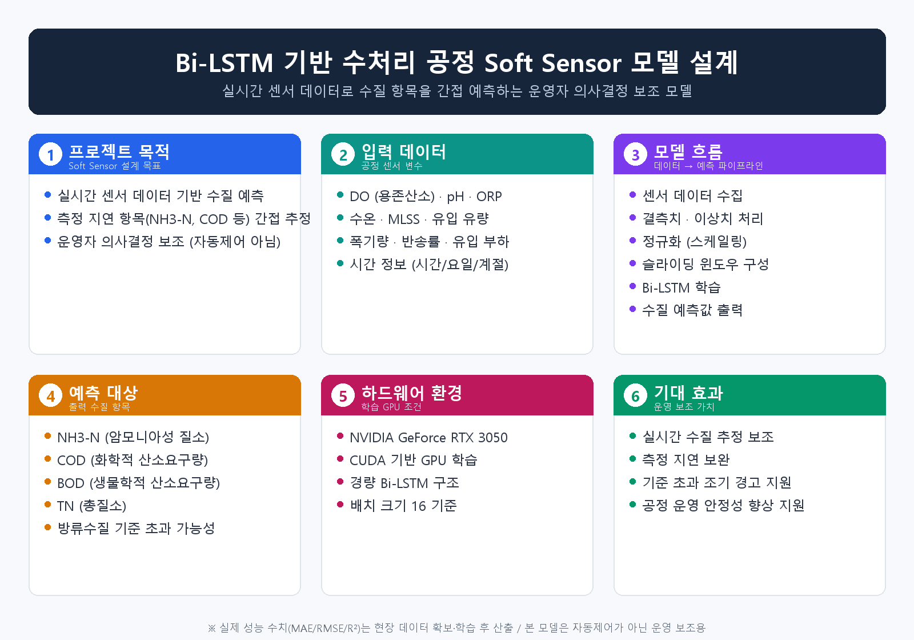

# Bi-LSTM Soft Sensor for Water Treatment

## 프로젝트 개요

본 프로젝트는 수처리 공정에서 수집되는 실시간 센서 데이터를 기반으로 직접 측정이 어렵거나 분석 지연이 발생할 수 있는 수질 항목을 예측하기 위한 Bi-LSTM 기반 Soft Sensor 모델 설계 프로젝트이다.

DO, pH, ORP, 수온, MLSS, 유입 유량, 폭기량, 반송률 등의 공정 데이터를 활용하여 NH3-N, COD, BOD, TN과 같은 주요 수질 항목을 간접 예측하는 것을 목표로 한다.

본 프로젝트는 자동 제어 시스템을 단정적으로 구현하는 것이 아니라, 수처리 공정 운영자의 의사결정을 보조하기 위한 수질 예측 모델 설계를 목적으로 한다.

## 프로젝트 소개 이미지

아래 이미지는 본 프로젝트의 핵심 내용을 한국어로 요약한 시각 자료이다.



## 핵심 목표

- 실시간 수처리 센서 데이터 기반 수질 예측
- NH3-N, COD, BOD, TN 간접 예측
- Bi-LSTM 기반 시계열 회귀 모델 설계
- 방류수질 기준 초과 가능성 조기 감지 보조
- NVIDIA GeForce RTX 3050 기반 경량 딥러닝 학습 환경 구성

## Hardware Target

본 프로젝트는 반드시 다음 GPU 환경을 기준으로 모델을 설정한다.

- GPU: NVIDIA GeForce RTX 3050
- CUDA 기반 GPU Acceleration 사용
- RTX 3050의 VRAM 한계를 고려한 경량 Bi-LSTM 모델 구성
- 대형 Transformer 또는 과도한 모델 구조는 사용하지 않음
- Batch Size, Hidden Size, Sequence Length를 RTX 3050에서 안정적으로 학습 가능한 수준으로 제한

## Model Configuration

```yaml
device: cuda
gpu: NVIDIA GeForce RTX 3050
model_type: BiLSTM
input_window: 24
prediction_horizon: 1
hidden_size: 64
num_layers: 2
dropout: 0.2
batch_size: 16
learning_rate: 0.001
optimizer: Adam
loss_function: MSELoss
epochs: 100
early_stopping_patience: 10
mixed_precision: true
```

## 입력 변수

| 변수    | 설명                  | 수질 예측에서의 의미              |
| ----- | ------------------- | ------------------------ |
| DO    | 용존산소                | 질산화 반응 및 폭기 상태와 관련       |
| pH    | 수소이온농도              | 미생물 활성 및 생물학적 처리 효율에 영향  |
| ORP   | 산화환원전위              | 질산화/탈질 반응 상태 추정 가능       |
| 수온    | Water Temperature   | 미생물 반응 속도와 처리 효율에 영향     |
| MLSS  | 혼합액 부유고형물           | 활성슬러지 농도 및 생물학적 처리능과 관련  |
| 유입 유량 | Influent Flow Rate  | 체류시간과 부하량 변화에 영향         |
| 폭기량   | Aeration Rate       | DO 제어 및 질산화 반응에 영향       |
| 반송률   | Return Sludge Ratio | 슬러지 농도 유지와 처리 안정성에 영향    |
| 유입 부하 | Influent Load       | COD, TN, NH3-N 변화의 주요 원인 |
| 시간 정보 | Hour, Day, Season   | 계절성, 일변동성, 운전 패턴 반영      |

## 출력 변수

본 모델은 다음 수질 항목을 예측 대상으로 설정할 수 있다.

* NH3-N
* COD
* BOD
* TN
* 방류수질 기준 초과 가능성 추정

초기 모델은 NH3-N 또는 COD 단일 타깃 예측으로 시작하고, 이후 다중 타깃 회귀 모델로 확장할 수 있다.

## 모델 구조

```text
실시간 수처리 센서 데이터
        ↓
결측치 처리 및 이상치 보정
        ↓
정규화 및 시간 단위 리샘플링
        ↓
Sliding Window 시계열 데이터 구성
        ↓
Bi-LSTM Layer
        ↓
Dropout Layer
        ↓
Dense Layer
        ↓
NH3-N / COD / BOD / TN 예측값 출력
```

## CUDA 확인 예시

본 프로젝트는 NVIDIA GeForce RTX 3050 GPU 사용을 전제로 하며, 학습 전 CUDA 인식 여부를 확인해야 한다.

```python
import torch

device = torch.device("cuda" if torch.cuda.is_available() else "cpu")

print("Selected device:", device)

if torch.cuda.is_available():
    print("GPU name:", torch.cuda.get_device_name(0))
    print("CUDA version:", torch.version.cuda)
else:
    print("CUDA is not available. Please check NVIDIA driver, CUDA, and PyTorch installation.")
```

## Tech Stack

* Python
* Pandas
* NumPy
* Scikit-learn
* PyTorch
* CUDA
* NVIDIA GeForce RTX 3050
* Matplotlib
* Time-Series Forecasting
* Bi-LSTM
* Soft Sensor
* Regression Model

## PyTorch 설치 안내

PyTorch는 사용자의 CUDA 버전에 맞추어 공식 설치 명령으로 설치해야 한다.

예시:

```bash
pip install torch torchvision torchaudio --index-url https://download.pytorch.org/whl/cu121
```

## 세부 문서

프로젝트의 상세 설계 문서는 아래 파일에서 확인할 수 있다.

[PROJECT_INTRO.md](./bilstm_soft_sensor_water_treatment/PROJECT_INTRO.md)
