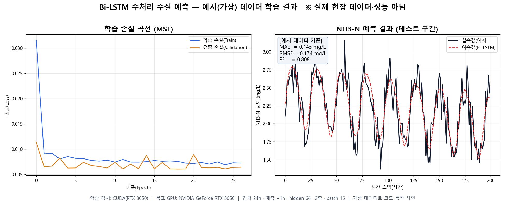
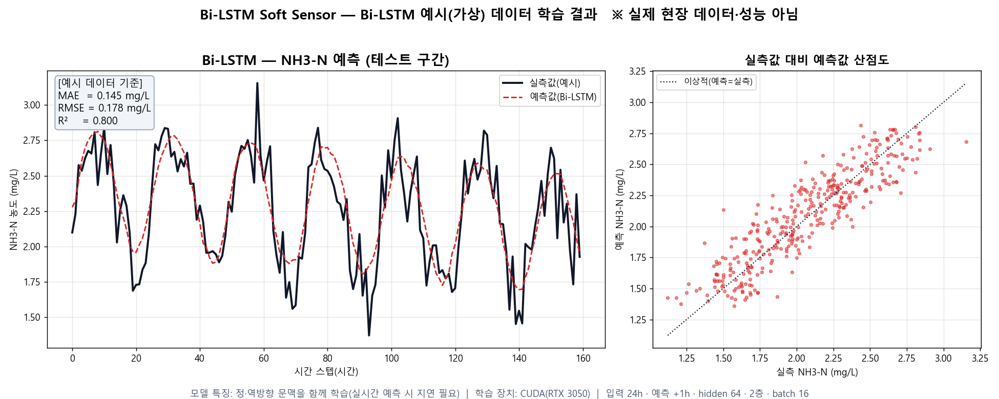
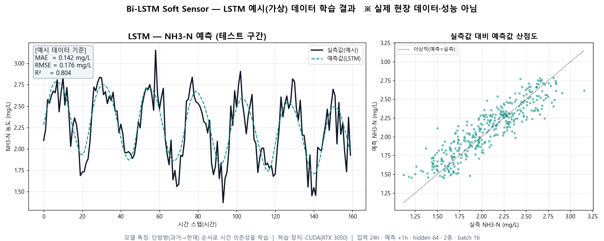
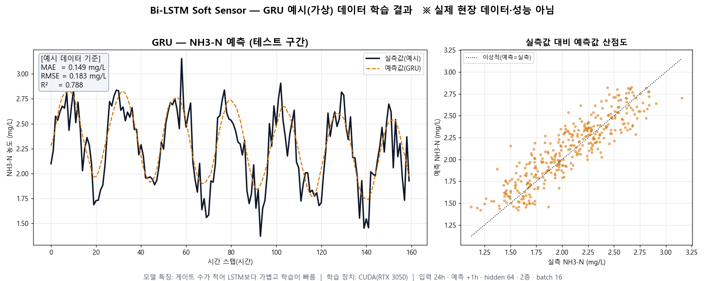
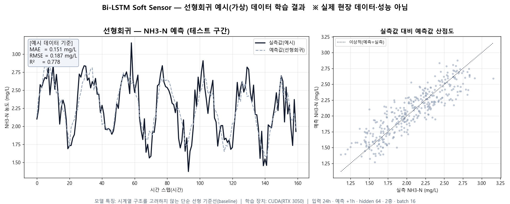
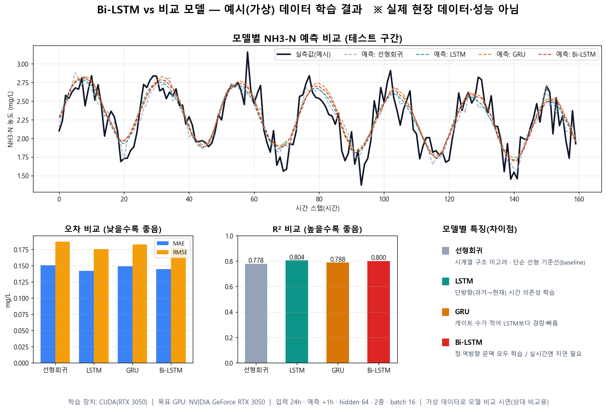

# 예시(가상) 데이터 기반 학습·비교 결과

> ⚠️ **주의**: 아래 모든 그림과 수치는 **합성(가상) 예시 데이터**로 코드 파이프라인이 GPU에서 정상 동작함을 보여주기 위한 **시연용 상대 비교값**입니다.
> **실제 수처리 현장 데이터 성능이 아니며**, 실제 성능은 현장 데이터 확보·학습 이후에 산출됩니다.
>
> - 학습 장치: **CUDA (NVIDIA GeForce RTX 3050)**
> - 공통 설정: 입력 24시간 · 예측 +1시간 · hidden 64 · 2층 · batch 16 · Adam · MSELoss · Early Stopping
> - 예측 대상(예시): NH3-N
> - 재현 스크립트: [`src/training/`](../src/training/) (`demo_train_example.py`, `demo_models_individual.py`, `demo_model_comparison.py`)

---

## 1. Bi-LSTM 학습 손실 + NH3-N 예측

학습/검증 손실 곡선과 테스트 구간 예측 결과이다.

---

## 2. Bi-LSTM 예측·산점도

---

## 3. LSTM 예측·산점도

---

## 4. GRU 예측·산점도

---

## 5. 선형회귀 예측·산점도

---

## 6. 모델별 성능 비교

4개 모델을 동일한 예시 데이터로 학습한 뒤 비교한 결과이다.

### 예시 데이터 기준 지표 (상대 비교용)

| 모델 | MAE (mg/L) | RMSE (mg/L) | R² | 특징(차이점) |
| --- | --- | --- | --- | --- |
| 선형회귀 | 0.151 | 0.187 | 0.778 | 시계열 구조 미고려, 단순 선형 기준선(baseline) |
| LSTM | 0.142 | 0.176 | 0.804 | 단방향(과거→현재) 시간 의존성 학습 |
| GRU | 0.149 | 0.183 | 0.788 | 게이트 수가 적어 LSTM보다 경량·빠름 |
| Bi-LSTM | 0.145 | 0.178 | 0.800 | 정·역방향 문맥 학습 / 실시간 예측 시 지연 필요 |

> 본 합성 예시 데이터는 과거→현재 방향 관계 위주로 생성되어 단방향 LSTM이 근소하게 앞선다. 이는 "양방향 구조가 항상 유리한 것은 아니며 데이터 특성에 따라 비교 검토가 필요하다"는 [PROJECT_INTRO.md](../PROJECT_INTRO.md)의 서술과 일치한다. 실제 현장 데이터에서는 결과가 달라질 수 있다.
